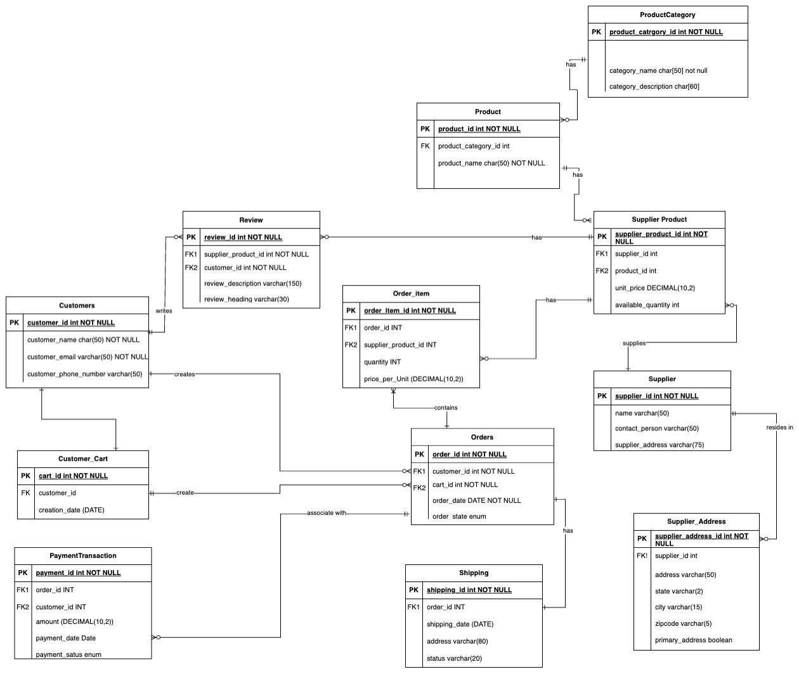
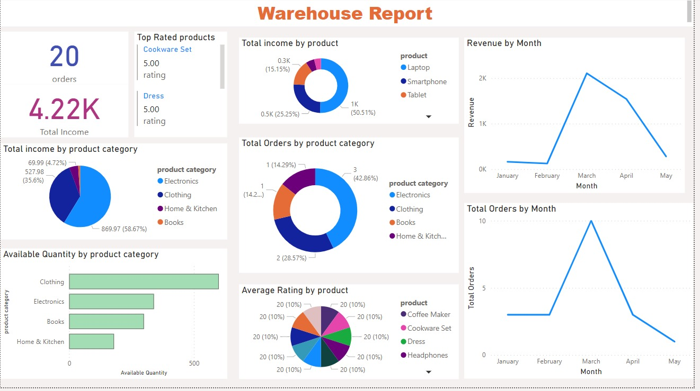

# Inventory Management Database Management System

## ER Diagram

## Logical Diagram

## Features

Product Management:

Design database tables and relationships to effectively manage product information, including details such as product name, description, price, and other relevant attributes.

Order Processing:

Implement a transaction management system that allows for the creation, updating, and tracking of orders, ensuring a smooth buying process for customers.

Inventory Control:

Establish a database structure for accurate and real-time inventory tracking, preventing issues like overselling and stockouts through automated updates.

Supplier-Product management:

Allow Suppliers to add, update, and manage their product listings.

Purchase Transactions:

Design the database to handle purchase transactions, including payment processing and order fulfillment, ensuring data consistency and integrity.

Customer Transactions:

Implement features for customers to browse products, add items to their cart, and complete transactions seamlessly, with a focus on database interactions.

Order History:

Develop a system to log and store order history, providing both customers and administrators with insights into past transactions.

Inventory Reporting:

Integrate reporting features within the database to generate insights into inventory levels, sales trends, and product popularity.

## Procedures

#### SearchProductsByCategory

**Purpose:** This procedure retrieves products based on a specified category name.

**Functionality:**
Accepts a category name as input.
Queries the database to fetch products belonging to the specified category.
Returns product details including ID, name, price, and category.

**Usage:** Useful when users want to browse or list products within a specific category.

#### GetCustomerCart

**Purpose:** Retrieves the items in a customer's cart associated with orders that are either failed or pending.
**Functionality:**
Takes a customer ID as input to identify the customer.
Queries order items, supplier products, and products linked with orders in failed or pending status.
Returns order ID, supplier product ID, product name, and unit price for each item in the cart.
**Usage:** Helps to handle customer inquiries or manage orders that are yet to be processed or have encountered issues.

#### GetCustomerByID

**Purpose:** Fetches details of a customer based on their ID.
**Functionality:**
Accepts a customer ID as input.
Retrieves customer name, email, and phone number associated with the provided ID.
Stores the fetched details in output parameters for further use.
**Usage:** Useful for accessing and displaying customer information in various scenarios such as order processing, customer support, or account management.

#### InsertProduct

**Purpose:** Adds a new product to the database.
**Functionality:**
Accepts product name, price, and category ID as input parameters.
Inserts a new record into the Product table with the provided details.
Effectively expands the product catalog by incorporating new items.
**Usage:** Enables administrators or authorized users to expand the range of available products within the system.

#### GetOrderDetails

**Purpose:** Retrieves details of a specific order.
**Functionality:**
Takes an order ID as input.
Fetches customer name, order date, total amount, and status associated with the provided order ID.
Stores the fetched details in output parameters for further processing.
**Usage:** Facilitates order tracking, customer service, and financial analysis by providing comprehensive order information.

## UDFs

#### ComputeTotalPrice

**Usage:** Computes the total price for a given quantity of a product at a specified unit price.
**Description:** This user-defined function calculates the total price by multiplying the quantity ordered by the unit price, providing an essential calculation for order itemization.
#### CalculateShippingCost

**Usage:** Calculates the shipping cost based on the total weight of the items in an order.
**Description:** This function determines the shipping cost, accounting for weight-based rates, where orders over 5 pounds incur an additional charge per pound.
#### ComputeTaxAmount

**Usage:** Computes the tax amount for a given subtotal and tax rate.
**Description:** This function calculates the tax amount based on the subtotal and the provided tax rate, facilitating accurate taxation calculation for orders.

## Triggers

#### Trigger Name: InitiateShippingOnPaymentSuccess

**Usage:** Automatically initiates shipping for orders when payment status is updated to 'success'.

**Description:** This trigger is activated after an update operation on the Payment_Transaction table. It checks if the payment status has been updated to 'success'. If so, it retrieves the associated order ID from the inserted table, then inserts a new shipping record into the Shipping table with details including order ID, customer ID, current date as the shipping date, and 'pending' status for shipping. This trigger ensures that shipping is initiated promptly upon successful payment to facilitate order fulfillment.

## Views

#### View 1: ProductInfoWithCategory

**Usage:** Provides comprehensive information about products along with their respective categories.
**Description:** This view combines data from the Product and ProductCategory tables, displaying product ID, name, price, and the associated category name. It offers a convenient way to retrieve product details along with their categories, aiding in product management and organization.

#### View 2: CustomerOrdersSummary

**Usage:** Presents a summary of customer orders including total number of orders and total amount spent.
**Description:** This view aggregates data from the Customer and Orders tables, showcasing each customer's ID, name, total number of orders placed, and the total amount spent across all orders. It offers insights into customer behavior and spending patterns, assisting in customer relationship management and business analysis.

#### View 3: HighRatedProducts

**Usage:** Identifies products with exceptionally high average ratings based on customer reviews.
**Description:** This view combines information from the Product and Reviews tables, displaying product ID, name, and the average rating calculated from customer reviews. It filters products to include only those with an average rating of 4.5 or higher, highlighting top-rated products for promotional purposes or customer preference analysis.

## Checks

Checks ensure data integrity and validity, validating various constraints such as order status, review ratings, payment status, quantity ordered, unit price, total price, review date, shipping status, review description, review ID, transaction ID, shipping ID, and tracking numbers.

## PowerBI Dashboard

## Instructions to run GUI

1. clone the repo
2. run cd GUI
3. Start sql server and ensure inventory database is created
3. run "streamlit run app.py"

## DEMO - GUI

